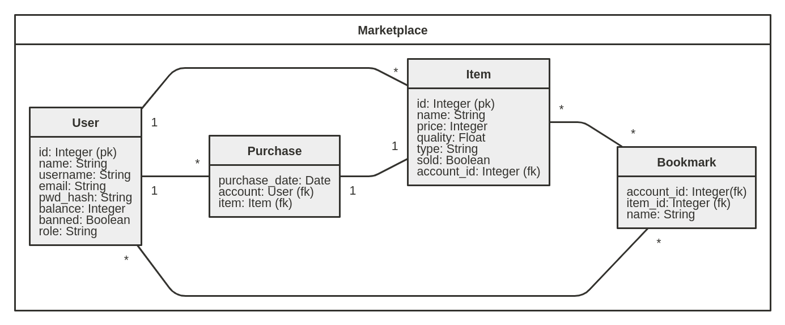

# Documentation

## Use cases

An unregistered user can:
> * browse items that are on sale
> * create a user account

A registered user can:
> * browse items that are on sale
> * add own items for sale
> * buy items
> * modify the price of users own products that are on sale
> * add balance to account

## Database diagram


## CREATE TABLE:
### Item:
```sql
CREATE TABLE Item (
    id INTEGER NOT NULL PRIMARY KEY,
    name VARCHAR(144),
    price INTEGER,
    quality FLOAT,
    item_type VARCHAR(144),
    sold BOOLEAN,
    account_id INTEGER,
    FOREIGN KEY (account_id) REFERENCES Account(account_id)
);
```
Item has a column sold, because every item is purchased only once and it would be unnecessary to go through all purchases when displaying an item

### Account:
```sql
CREATE TABLE Account (
    id INTEGER NOT NULL PRIMARY KEY,
    name VARCHAR(144),
    username VARCHAR(144),
    email VARCHAR(144),
    pwd_hash VARCHAR(144),
    balance INTEGER,
    banned BOOLEAN,
    role VARCHAR(144)
);
```

### Purchase:
```sql
CREATE TABLE Purchase (
    item_id INTEGER,
    account_id INTEGER,
    FOREIGN KEY (item_id) REFERENCES Item(item_id),
    FOREIGN KEY (account_id) REFERENCES Account(account_id)
);
```

## SQL-queries for different use cases

Browse items that are on sale:
```sql
SELECT Item.id, Item.name, Item.price, Item.quality, Item.item_type, Item.sold, Account.username FROM Item
    JOIN Account ON Account.id = Item.account_id
    WHERE Item.sold = FALSE;
```

Create a user account:
```sql
INSERT INTO Account(name, username, email, pwd_hash, balance, banned, role) VALUES(?,?,?,?,?,?,?);
```

Add own items for sale:
```sql
INSERT INTO Item(name, price, quality, item_type, sold) 
    VALUES("name", 20000, 0.234, "Common", FALSE);
```

Buy items:
```sql
INSERT INTO Purchase(account_id, item_id) VALUES(?,?);
```

Add balance to account:
```sql
UPDATE Account
    SET balance = balance + 10000
    WHERE Account.id = ?;
```

Modify items:
```sql
UPDATE Item
    SET name="newname", price=12345, quality=0.345, item_type="Legendary", sold=FALSE
    WHERE Item.id = 1;
```