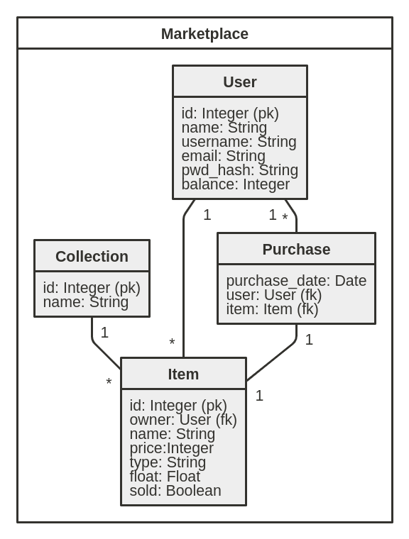

# Documentation

## Use cases

An unregistered user can:
> * browse items that are on sale
> * create a user account

A registered user can:
> * browse items that are on sale
> * add own items for sale
> * buy items
> * modify the price of users own products that are on sale
> * add balance to account

## Database diagram
